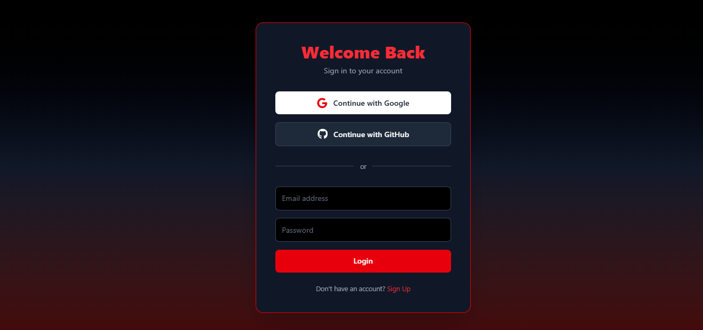
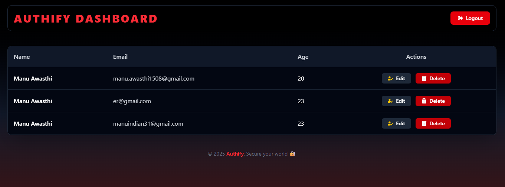

# 🔐 Authify – Modern Authentication System (MERN + OAuth + JWT)

Authify is a full-stack authentication system built using the **MERN stack** with **Google and GitHub OAuth**, **JWT-based authentication**, and a fully responsive **React frontend**.  
The application allows users to sign in securely, access protected routes, and manage sessions efficiently.

---

## 🚀 Live Demo  
🔗 **Frontend Live:** https://authi-fy-1.onrender.com  
🔗 **Code Repository:** https://github.com/Manu-awasthi/Authi_fy  

---

## 🖼 Screenshots  
(Add your screenshots inside `/assets/` folder and paste the links here)

### 🔹 Login Page  

### 🔹 Dashboard (Protected Route)  

---

## 🧱 Tech Stack

### **Frontend**
- React.js  
- Context API  
- Hooks  
- Tailwind CSS  

### **Backend**
- Node.js  
- Express.js  
- Passport.js (OAuth 2.0)  
- JSON Web Token (JWT)  
- Bcrypt / Sessions  

### **Database**
- MongoDB  
- Mongoose  

### **Deployment**
- Frontend: Vercel / Netlify  
- Backend: Render / Railway  

---

## ✨ Features  
- 🔑 **Google OAuth Login**  
- 🐙 **GitHub OAuth Login**  
- 🔐 **JWT Authentication**  
- 🚪 **Protected Routes**  
- 📁 **MongoDB User Schema**  
- 🛠 **Middleware for auth, errors & validation**  
- 🌐 **Fully responsive UI using TailwindCSS**  
- ⚙️ **Environment variable configuration**  
- 📦 **Clean folder structure (MVC style)**  

---

## 📂 Project Structure  
Authi_fy/
│
├── backend/
│ ├── config/
│ ├── controllers/
│ ├── middleware/
│ ├── models/
│ ├── routes/
│ ├── utils/
│ └── server.js
│
└── frontend/
├── public/
├── src/
│ ├── components/
│ ├── context/
│ ├── pages/
│ └── App.js
└── package.json

---

## 🛠 Installation (Local Setup)

### 1️⃣ Clone repo  

git clone https://github.com/Manu-awasthi/Authi_fy.git
cd Authi_fy

### 2️⃣ Install backend dependencies
cd backend
npm install

3️⃣ Install frontend dependencies
cd ../frontend
npm install

also make your own env file with your own client ID and client secrets ....

Future Enhancements
🔐 Two-Factor Authentication (2FA)

👮 Admin Dashboard

🧮 Login attempt monitoring

📨 Email Verification

Contributing

Pull requests are welcome.
For major changes, open an issue first.

  
  ## Author ##

Manu Awasthi
🔗 GitHub: https://github.com/Manu-awasthi

🔗 LinkedIn: https://linkedin.com/in/manu-awasthi31

